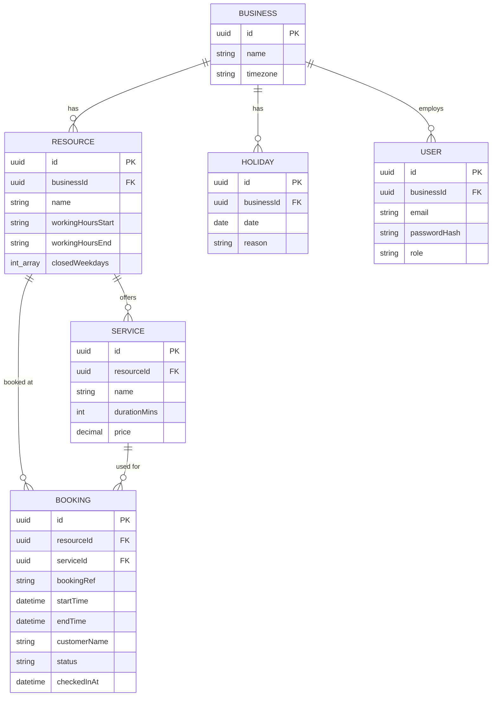
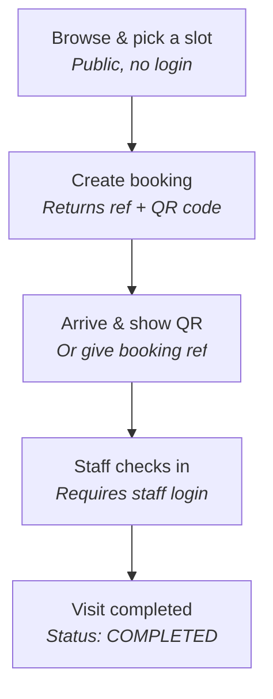
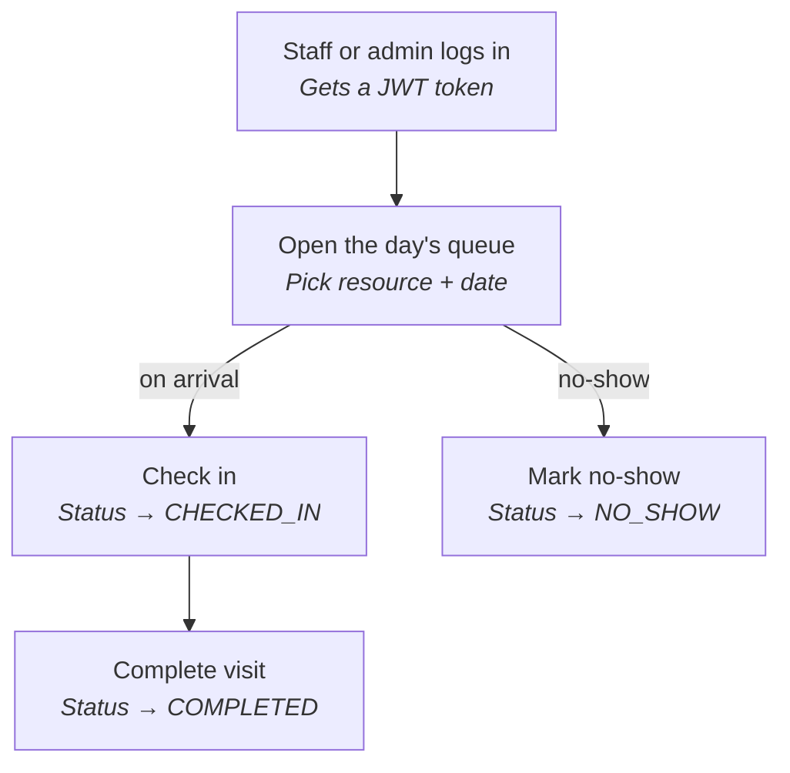

# Booking System — Diagrams

Mermaid diagrams. GitHub renders these natively; in VS Code install the "Markdown Preview
Mermaid Support" extension, then open Preview (`Ctrl+Shift+V` / `Cmd+Shift+V`).

## ER diagram

No `Slot` table — availability is computed on demand from `Resource.workingHoursStart/End`
minus existing `Booking` rows minus `Holiday`/`closedWeekdays`, not stored. See the "why no
Slot table" Q&A in `interview-prep-backend.md` (Phase 2 section) for the full reasoning.

## Customer booking & check-in flow

## Staff queue management flow

